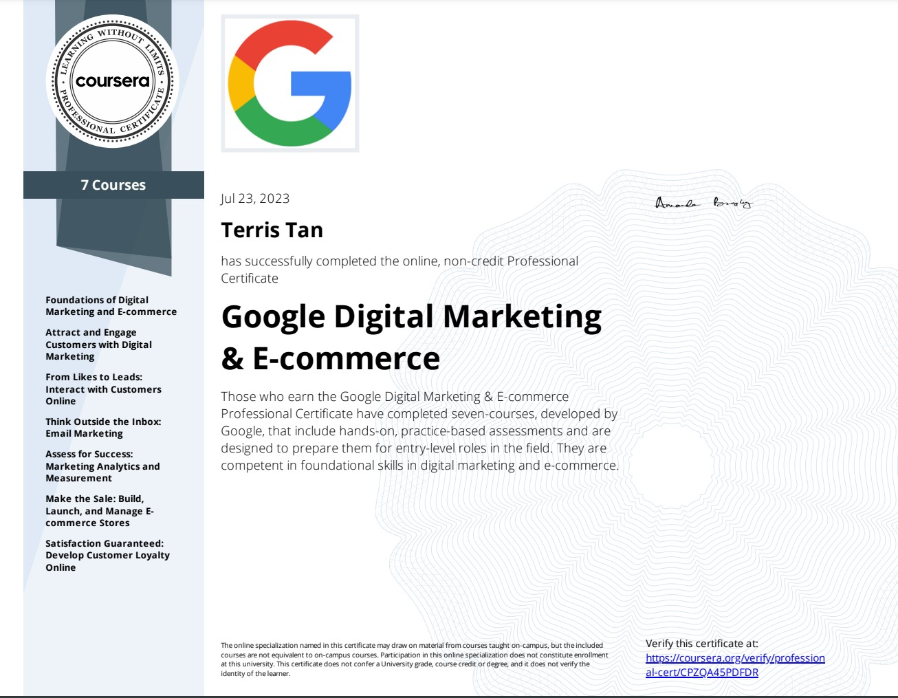

## [Google Digital Marketing & E-commerce Professional Certificate](https://www.coursera.org/programs/smu-software-engineering-wsdeg-uhmy4/professional-certificates/google-digital-marketing-ecommerce)

 

 

### About this Professional Certificate

Prepare for a new career in the high-growth fields of digital marketing and e-commerce, in under six months, no experience or degree required. Businesses need digital marketing and e-commerce talent more than ever before; 86% of business leaders report that digital commerce will be the most important route to growth. There are over 213,000 open jobs in digital marketing and e-commerce with a median entry-level salary of $59,000.

Throughout this program, you will gain in-demand skills that prepare you for an entry-level job and learn how to use tools and platforms like Canva, Constant Contact, Google Ads, Google Analytics, Hootsuite, HubSpot, Mailchimp, Shopify, and Twitter. You will learn from subject-matter experts at Google and have a chance to build your own portfolio with projects like customer personas and social media calendars to show to potential employers.

This program contains no confidential information. All Google Search features taught are publicly available, you can learn more in official [Google Search documentation](https://developers.google.com/search/docs).

---

### Applied Learning Project

This program includes over 190 hours of instruction and practice-based assessments, which simulate real-world digital marketing and e-commerce scenarios that are critical for success in the workplace. The content is highly interactive and developed by Google employees with experience in the field.

**Skills you’ll gain will include:** Developing digital marketing and e-commerce strategies; attracting and engaging customers through digital marketing channels like search and email; measuring marketing analytics and sharing insights; building e-commerce stores, analyzing e-commerce performance, and building customer loyalty.

**Platforms and tools you will learn include:** Canva, Constant Contact, Google Ads, Google Analytics, Hootsuite, HubSpot, Mailchimp, Shopify, and Twitter

Through a mix of videos, assessments, and hands-on activities, you’ll learn how to use popular tools and platforms required for an entry-level job. Learn concrete skills that top employers are hiring for right now.

---

## What you will learn

- Learn the fundamentals of digital marketing and e-commerce to gain the skills needed to land an entry-level job
- Attract and engage customers through digital marketing channels like search and email
- Measure marketing performance through analytics and present insights
- Build e-commerce stores, analyze online performance, and grow customer loyalty

---

## Skills you’ll gain:

| **Digital Marketing** |   **E-Commerce**   |      **Management**       |     **Others**      |
| :-------------------: | :----------------: | :-----------------------: | :-----------------: |
|     Social Media      |  Web Development   | Leadership and Management |      Strategy       |
|       Marketing       |   Data Analysis    |     Brand Management      | Research and Design |
|      Advertising      | Data Visualization |  Strategy and Operations  |    Storytelling     |
|         Sales         |                    |     Entrepreneurship      |       Writing       |
|                       |                    |  Business Communication   |                     |
|                       |                    |                           |                     |
